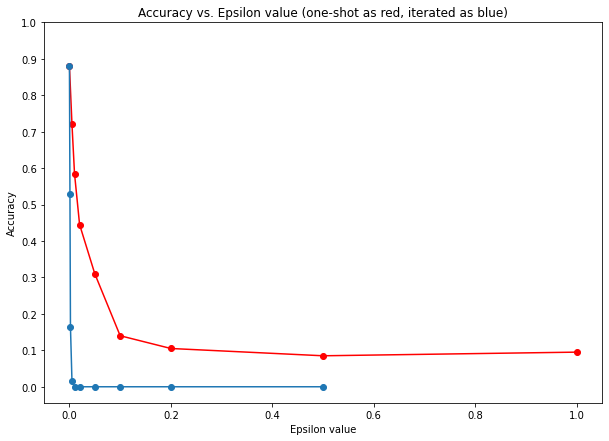
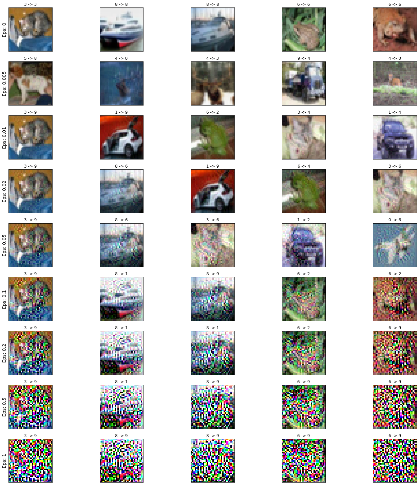
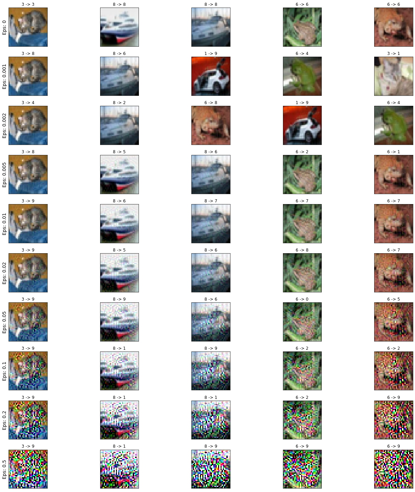

# SUTD 2022 50.039 Theory and Practice of Deep Learning Homework 9 Report

> James Raphael Tiovalen / 1004555

## Part 1

A. Copy and paste the code for your `iugm_attack()` function from this notebook.

```python
def iugm_attack(image, epsilon, model, original_label, iter_num = 10):
    # Skip if epsilon is 0
    if epsilon == 0:
        return image

    for _ in range(iter_num):
        # Zero out previous gradients
        image.grad = None

        # Forward pass
        output = model(image)

        # Get the index of the least probable class (min log-probability)
        _, target_class = torch.min(output.data, 1)

        # Calculate loss based on the least probable class
        pred_loss = F.nll_loss(output, target_class)

        # Backward pass and retain graph
        pred_loss.backward(retain_graph=True)

        # Gradient descent to the least probable class (target class)
        eps_image = image - epsilon * image.grad.data
        eps_image.retain_grad()

        # Clipping to maintain pixel values in the [0, 1] range
        eps_image = torch.clamp(eps_image, 0, 1)

        # Forward pass
        new_output = model(eps_image)

        # Get prediction
        _, new_label = new_output.data.max(1)

        # Check if label is different from the original, if so stop
        if new_label != original_label:
            break
        else:
            image = eps_image
            image.retain_grad()

    return eps_image
```

B. Take screenshots of the accuracy vs. epsilon graph and display them in your report. Why are the two curves different? Is that something we expected and how can we explain this difference of behavior?



Observations:

- As the epsilon value increases, the accuracy of both the one-shot attack and the iterated attacks decrease.
- For both curves, the accuracy experiences a sharp drop initially, and then appears to stabilize when epsilon values get larger. The initial sharp drop indicates that the addition of some small noise is effective in moving the samples toward the least probable targeted class through gradient descent on the logits (of the least probable targeted class), thereby misclassifying them.
- The iterated attack decreases the accuracy much faster than the one-shot attack as epsilon value increases. The blue curve (iterated attack) is always below the red curve (one-shot attack), with an initial drop that is more significant. This difference is to be expected since the iterated attack is essentially an improvement of the one-shot attack. The iterated attack is able to repeat the attack until it reaches a maximal number of iterations or makes the model malfunction, whereas the one-shot attack only has 1 attempt. In particular, the iterated attack is able to continue adjusting the sample from the previous failed attempt to make the model predict the incorrect class.
- After a certain epsilon value, the curves plateau at a minimum accuracy. This epsilon value is different for the two curves.
- The one-shot attack is only able to achieve an accuracy as low as that of random guessing, which is around 0.10, while the iterated attack is able to decrease accuracy to a lower level of 0.0. At these levels of accuracy, the curves plateau. The accuracy for the one-shot attack plateaus at 0.10 even with increasing values of epsilon. This is not surprising because the performance is rather close to random prediction, which will be about 10% accurate assuming there are 10 balanced classes in CIFAR10 dataset. On the other hand, the accuracy for the iterated attack plateaus at 0 even with increasing values of epsilon. This is expected too because with a larger epsilon and more retries allowed, it is almost guaranteed that an update will move the sample further away from its original class, and likely resulting in misclassification.

Why the difference in curves?

- The iterated attack is able to decrease the accuracy of the model much faster than the one-shot attack because more "jumps" are made per epsilon value, allowing the attack to change the images more to fool the model.
- The iterated attack is able to achieve a lower accuracy than the one-shot attack. The iterated attack is able to target and change the class of each image to its least possible class while the one-shot attack is only able to alter the image once, which is not enough to ensure that the images are labelled as another class completely, but only enough for the model to predict with an accuracy close to guessing.

C. Take screenshots of the attack samples display for different values of epsilon and display them in your report. What seems to be the threshold for plausibility for both attacks (alpha and beta)? Is attack beta a better one? Why do you think that might be the case (or not)?

One-Shot Attack Samples:



Iterated Attack Samples:



Threshold of plausibility for both attacks is at around epsilon value = 0.02.

Attack beta is better than attack alpha. For attack alpha, the lowest accuracy is at 0.085, which is actually just slightly worse than random guessing. On the other hand, attack beta is able to get the model to predict the classes of all images wrongly (i.e., cause the model to achieve 0% accuracy) at the epsilon value of 0.01, which is still lower than the threshold of plausibility.

With the same plausibility, attack beta is able to lower the model accuracy even more. For example, at epsilon = 0.02, the model accuracy is 0.445 for alpha, as compared to 0 for beta.

D. Plausibility seems problematic, even with the iterated version of the gradient attack. Can you suggest two possible ways to improve our attack strategy on this dataset and model?

1. Use the fast gradient sign method, which only uses the sign of the gradient to create/generate an attack sample. This will help make plausible samples as there will be a plausibility constraint. As mentioned in class, the range of epsilon values to be tested could be lowered to allow for greater plausibility without sacrificing efficacy. In this approach, the plausibility constraint  still holds.
2. Limit the number of pixels changed to a small number. This would enforce a second plausibility constraint on the  norm between the generated and original image. This will bound on the total number of pixels that can be modified and only add noise to these pixels to create the attack sample.

## Part 2

A. Copy and paste your SkipGram class code (Task #1 in the notebook).

```python
class SkipGram(nn.Module):
    """
    Your skipgram model here!
    """

    def __init__(self, context_size, embedding_dim, vocab_size):
        super(SkipGram, self).__init__()
        self.context_size = context_size

        self.embeddings = nn.Embedding(vocab_size, embedding_dim)
        self.linear1 = nn.Linear(embedding_dim, 512) # This additional linear layer helps to marginally improve the model!
        self.linear2 = nn.Linear(512, 2 * context_size * vocab_size)

    def forward(self, inputs):
        x = self.embeddings(inputs).view((1, -1))
        x = F.relu(self.linear1(x))
        x = self.linear2(x)
        log_probs = F.log_softmax(x, dim=1).view(2 * self.context_size, -1)
        return log_probs
```

B. Copy and paste your train function (Task #2 in the notebook), along with any helper functions you might have used (e.g., a function to compute the accuracy of your model after each iteration). Please also copy and paste the function call with the parameters you used for the train() function.

```python
def get_prediction(context, model, word2index):
    """
    This is a helper function to get predictions from our model.
    """
    context_idxs = torch.tensor([word2index[context]], dtype=torch.long).cuda()
    log_probs = model(context_idxs)
    output_ids = torch.argmax(log_probs, dim=1)

    return output_ids

def check_accuracy(model, data, word2index):
    total_count = 0
    correct_count = 0

    for context, targets in data:
        output_ids = get_prediction(context, model, word2index).tolist()

        target_list = [word2index[w] for w in targets]

        for target in target_list:
            if target in output_ids:
                correct_count += 1
                output_ids.remove(target)

        total_count += len(target_list)

    return correct_count / total_count

def train(data, word2index, model, epochs, loss_func, optimizer):
    """
    This is a trainer function to train our SkipGram model.
    """
    losses = []
    accuracies = []
    for epoch_no in range(epochs):
        model.train()

        e_loss = 0
        for context, targets in data:
            # Step 1. Prepare the inputs to be passed to the model (i.e, turn
            # the words into integer indices and wrap them in tensors)
            context_idxs = torch.tensor([word2index[context]], dtype=torch.long).cuda()

            # Step 2. Recall that torch *accumulates* gradients. Before passing
            # in a new instance, you need to zero out the gradients from the old
            # instance
            optimizer.zero_grad()

            # Step 3. Run the forward pass, getting log probabilities over next
            # words
            log_probs = model(context_idxs)

            # Step 4. Compute your loss function. (Again, Torch wants the target
            # word wrapped in a tensor)
            target_list = torch.tensor([word2index[w] for w in targets], dtype=torch.long).cuda()
            loss = loss_func(log_probs, target_list)

            # Step 5. Do the backward pass and update the gradient
            loss.backward()
            optimizer.step()

            # Step 6. Get the Python number from a 1-element Tensor by calling tensor.item()
            e_loss += loss.item()

        model.eval()

        with torch.no_grad():
            e_loss /= len(data)
            accuracy = check_accuracy(model, data, word2index)

            print(f"Epoch {epoch_no+1}: loss - {e_loss}; accuracy - {accuracy}")

            losses.append(e_loss)
            accuracies.append(accuracy)

    return losses, accuracies, model

losses, accuracies, model = train(data, word2index, model, epochs, loss_function, optimizer)
```

C. Why is the SkipGram model much more difficult to train than the CBoW? Is it problematic if it does not reach a 100% accuracy on the task it is being trained on?

Because the SkipGram model tries to predict a word's context from a single word, as compared to the CBoW which tries to predict a single word from the word's context. As the SkipGram has to perform more elaborate predictions based on less data, this makes SkipGram a much more difficult model to train than CBoW. However, it is not problematic if it does not reach a 100% accuracy, because the motive of training these tasks are to obtain the embeddings learnt, rather than use the whole model. Even when the task being trained on does not reach 100% accuracy, the embedding layer might have already been sufficiently trained.

D. If we were to evaluate this model by using intrinsic methods, what could be a possible approach to do so?

We could check the relationship between the resulting embeddings from the trained embedding layer. The vectors should behave in the following ways (not exhaustive):

1. Cosine similarity between embeddings of words with similar meanings should be close to 1.
2. Embeddings should be able to recognize word analogies (e.g. 'man' is to 'woman' = 'king' is to 'queen')
3. Slight typos/variations of words should have cosine similarity of close to 1.

E. (Optional) Please submit any additional code you might that will demonstrate the performance/problems of the word embedding you have trained!

First, we used 825 as the custom number of epochs to train the word embedding model and achieve about 47.38% accuracy.

We then use the following code to more qualitatively evaluate the model:

```python
# Save the trained model
torch.save(model.state_dict(), "model.pth")

# Load the trained model
model = SkipGram(context_size = 2, embedding_dim = 20, vocab_size = len(vocab))
model = model.cuda()
model.load_state_dict(torch.load("model.pth"))
model.eval()

# Inspect the model's state_dict
model.state_dict()

# Inspect the model's embedding weights
model.state_dict()['embeddings.weight']

# Extract the embedding weights
embedding_layer = nn.Embedding(len(vocab), 20)
embedding_layer.weight = torch.nn.Parameter(model.state_dict()['embeddings.weight'])
embedding_layer.eval()

print([word2index['his']])

his_context_id = torch.zeros(len(vocab)).cuda().long()
his_context_id[word2index['his']] = 1.
his_vec = embedding_layer(his_context_id)
print(his_vec)

her_context_id = torch.zeros(len(vocab)).cuda().long()
her_context_id[word2index['her']] = 1.
her_vec = embedding_layer(her_context_id)
print(her_vec)

lion_context_id = torch.zeros(len(vocab)).cuda().long()
lion_context_id[word2index['lion']] = 1.
lion_vec = embedding_layer(lion_context_id)
print(lion_vec)

lioness_context_id = torch.zeros(len(vocab)).cuda().long()
lioness_context_id[word2index['lioness']] = 1.
lioness_vec = embedding_layer(lioness_context_id)
print(lioness_vec)

his_her_sim = F.cosine_similarity(his_vec, her_vec, dim=0)
print(f"Cosine similarity of 'his' and 'her': {his_her_sim}")
lion_lioness_sim = F.cosine_similarity(lion_vec, lioness_vec, dim=0)
print(f"Cosine similarity of 'lion' and 'lioness': {lion_lioness_sim}")

his_lion_sim = F.cosine_similarity(his_vec, lion_vec, dim=0)
print(f"Cosine similarity of 'his' and 'lion': {his_lion_sim}")
his_lioness_sim = F.cosine_similarity(his_vec, lioness_vec, dim=0)
print(f"Cosine similarity of 'his' and 'lioness': {his_lioness_sim}")
her_lion_sim = F.cosine_similarity(her_vec, lion_vec, dim=0)
print(f"Cosine similarity of 'her' and 'lion': {her_lion_sim}")
her_lioness_sim = F.cosine_similarity(her_vec, lioness_vec, dim=0)
print(f"Cosine similarity of 'her' and 'lioness': {her_lioness_sim}")
```

As demonstrated, the word embedding model is not able to recognize word analogies and extract gender-related vectors properly. This might be caused by the small dataset size.

At the very least, when running the following code, the model is able to print somewhat meaningful word predictions:

```python
def predict_context_words(skipgram_model, sample_input):
    context_pred_idxs = get_prediction(sample_input, skipgram_model, word2index).tolist()
    context_preds = [index2word[idx] for idx in context_pred_idxs]
    return context_preds

# Initialize another untrained SkipGram model to compare against
untrained_model = SkipGram(context_size = 2, embedding_dim = 20, vocab_size = len(vocab))
untrained_model = untrained_model.cuda()

# Get predictions
untrained_predictions = predict_context_words(untrained_model, "lion")
trained_predictions = predict_context_words(model, "lion")

print("Predicted Context Words from Untrained Model: {}".format(untrained_predictions))
print("Predicted Context Words from Trained Model: {}".format(trained_predictions))
```

The untrained model would spew out random words such as: `['being', 'company', 'as', 'wells']`, while the trained model would predict somewhat related context words such as: `['lioness', 'the', 'king', 'to']`. That said, the predicted words include several commonly-used stop words such as 'the' and 'to', which could potentially be detrimental to the model's performance in real-life applications and scenarios. Hence, one possible way to improve the model's performance is to preprocess the dataset to remove all irrelevant stop words.
